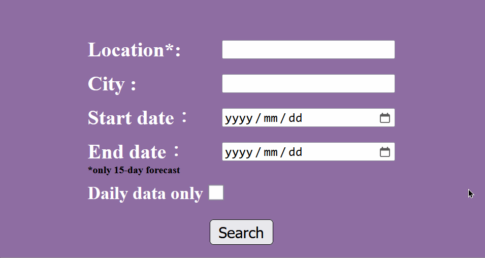

# Weather API

Sample solution for the [weather API](https://roadmap.sh/projects/weather-api-wrapper-service) challenge from [roadmap.sh](https://roadmap.sh/roadmaps).

## Intoduction

This project is a Weather API that fetches weather data from third-party sources. Its uses Flask Limiter for rate limiting and Redis caching for imporved performance. Sensitive information is stored using environment variables, and errors are logged with Python's logging module.

## Feature

- **Weather Data Retrival**: Fetches real-time weather information from third-party service(Visual Crossing Weather API).
- **Caching**: Implements Redis caching to improve performance by reducing redundant data requests.
- **Rate Limiting**: Uses Flask Limiter to control the frequency of API requests and avoid exceeding limits.
- **Enviornment Variable Management**: Sensitive data(like API keys) is securely stored using enviornment variables.
- **Error Logging**: Logs errors and important events using Pythin's built-in logging module for better debugging and monitoring.

## Tools & Libraries

- **Flask**: A lightweight web framework for building the API.
- **Flask-Limiter**: Used for rate-limiting API request.
- **Redis**: A database used for caching to imporve performance.
- **urllib3**: A HTTP library for making requests to external APIs.
- **certifi**: Provides SSL certificates to ensure secure HTTP requests.
- **Python-dotenv**: Loads environment variables from a `.env` file to securely store sensituve information like API keys.
- **Logging**: Python's built-in logging module for tracking errors and application events.

## Browser Interface(HTML)

This Weather API includes a user-friendly HTML interface that allows you to easily query weather data directly through your web browser.

1. Accessing the interface:
   Once the Weather API server is running, you can open your browser and nevigate to :

   ```shell
   http://127.0.0.1:5500
   ```

2. Using the interface:

- **Location(Required)**: Enter the name of the Location(e.g.,"UK") in the appropriate input filed.
- **City(Optional)**: Enter the name of the city (e.g., "London").
- **Start date(Optional)**: Select the start date for the weather data.
- **End date(Optional)**: Select the end date for the weather data.
- **Daily Data (Optional)**:
  - If unchecked, the result will include hourly data for each day.
  - If checked, the result will only show daily summaries without hourly breakdowns.
- **Search**: After filling in the location and optionally selecting the date, click the search button to retrieve the weather data for the specified location and date range.



## Installation

To get started with this project, clone the repository to your local machine:

```shell
# Clone the repository
git clone https://github.com/HsinLing-Chang/Weather-API.git

# Navigate into the cloned project directory
cd Weather-API
```

## How to run

Before accessing the browser interface, you need to start the application by running app.py from the command line.

1. Start the Flask Server:
   Open the terminal and nevigate to the project directory where app.py is located.

   ```shell
   python app.py
   ```

   This will start the server on 127.0.0.1 (localhost) at port 5500.

2. Open the Browser Interface:
   After starting the server, open your web browser and go to `http://127.0.0.1:5000` to access the HTML interface.
